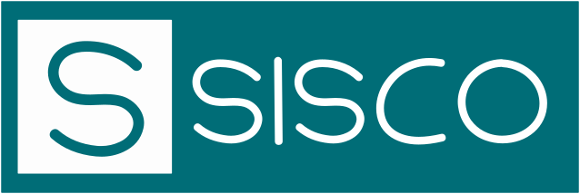

# SisCO - Sistema de Controle de Ocorrências

## Sobre o sistema

Este é um sistema desenvolvido para controlar as ocorrências de uma escola, permitindo que a equipe gestora possa monitorar e gerenciar as situações problemáticas que ocorrem dentro do ambiente escolar.

O sistema permite o cadastro de ocorrências relacionadas a diversos tipos de situações, como conflitos entre alunos, problemas de disciplina em sala de aula, incidentes de segurança, entre outros. As ocorrências podem ser cadastradas por funcionários da escola que tenham acesso ao sistema.

Além do cadastro de ocorrências, o sistema permite o acompanhamento e gerenciamento dessas situações, permitindo que a equipe gestora possa tomar medidas para resolver o problema e evitar que ele se repita.

O sistema possui uma interface amigável e intuitiva, que facilita o uso por parte dos usuários. É possível realizar consultas, gerar relatórios e exportar dados em diferentes formatos para facilitar a análise das informações.

Este sistema é uma ferramenta essencial para as escolas que desejam manter um ambiente seguro e saudável para seus alunos, permitindo o controle e gerenciamento eficiente de ocorrências.

## Tabela de conteúdos

-   [Sobre](#sobre-o-sistema)
-   [Tabela de Conteúdos](#tabela-de-conteúdos)
-   [Pré-requisitos](#pré-requisitos)
    -   [Instalando o sistema](#instalando-o-sistema)
-   [Screenshots](#screenshots)
-   [Tecnologias](#tecnologias)
-   [Contribuições](#contribuições)

<h4 align="center"> 
	🚧 SisCO 🚀 Concluído  🚧
</h4>

## Pré-requisitos

Antes de começar a aproveitar o sistema, deve ser levado em consideração a instalação de tal programa.

### Instalando o sistema

## Screenshots

## Tecnologias

Para a realização desse projeto, utilizamos as seguintes tecnologias:

-   [Laravel](https://laravel.com/docs/10.x/readme)
-   [Bootstrap](https://getbootstrap.com.br/docs/4.1/getting-started/introduction/)
-   [jQuery Mask](https://api.jquery.com/)
-   [jQuery Validation](https://jqueryvalidation.org/documentation/)

## Contribuições

<table>
  <tr>
    <td align="center"><a href="https://rocketseat.com.br"> <b>Bianca Sousa</b></a> 👨‍🚀</td>
    <td align="center"><a href="https://rocketseat.com.br"> <b>Davi Francisco</b></a> 👨‍🚀</td>
    <td align="center"><a href="https://github.com/emilsonfilho"> <b>Francisco Emilson</b></a> 👨‍🚀</td>
    <td align="center"><a href="https://github.com/emilsonfilho"> <b>Gabriel Dickinson</b></a> 👨‍🚀</td>
  </tr>
</table>

